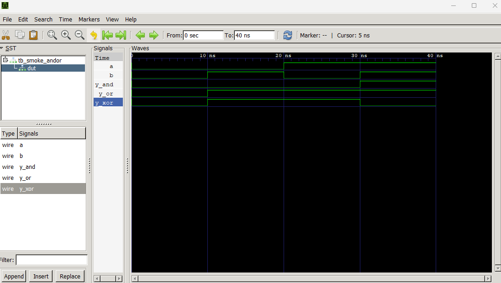

# Lab00: Introducción a Verilog, Simulación y Máquinas de Estados Finitos (FSM)

## Contenido
- Objetivos de aprendizaje  
- Fundamento teórico  
- Procedimiento  
- Descripción del HDL base  
- Entregables  

---

## 1. Objetivos de aprendizaje

- Instalar y verificar el correcto funcionamiento de **Icarus Verilog** y **GTKWave**.
- Comprender la diferencia entre **lógica combinacional** y **lógica secuencial**.
- Diseñar e implementar **Máquinas de Estados Finitos (FSM)** sencillas en Verilog.
- Implementar sistemas que operan a lo largo de **varios ciclos de reloj**.
- Validar el comportamiento de los diseños mediante **testbench** y visualización de señales en GTKWave.

---

## 2. Fundamento teórico

### 2.1 Lógica secuencial y sincronización

A diferencia de la lógica combinacional, en la cual las salidas dependen únicamente de las entradas actuales, la lógica secuencial incorpora **elementos de memoria** que permiten almacenar información entre ciclos de reloj.  
El comportamiento del sistema depende del **estado previo** y de las entradas presentes, siendo el reloj el encargado de sincronizar los cambios.

En HDL, este tipo de lógica se describe típicamente mediante bloques `always @(posedge clk)`.

---

### 2.2 Máquinas de Estados Finitos (FSM)

Una Máquina de Estados Finitos es un modelo de control secuencial en el que el sistema:

- Se encuentra en **un solo estado a la vez**.
- Cambia de estado en función de:
  - El estado actual
  - Las entradas
- Produce salidas asociadas a los estados y/o transiciones.

Las FSM permiten describir de forma estructurada sistemas que requieren **control temporal**, siendo ampliamente utilizadas en:
- Unidades de control
- Protocolos
- Sistemas secuenciales complejos

---

### 2.3 Relación entre FSM y sistemas digitales complejos

Muchos sistemas digitales, como multiplicadores secuenciales, ALUs y procesadores, se construyen a partir de dos bloques principales:

- **Unidad de control** (FSM)
- **Datapath** (registros, sumadores, contadores, etc.)

Este laboratorio introduce estos conceptos de forma progresiva, preparando al estudiante para diseños más complejos en laboratorios posteriores.

---

## 3. Procedimiento

### 3.0.0 Instalación de Icarus Verilog (+GTK wave) y editor de código (Visual Studio Code)

Antes de iniciar los ejercicios del laboratorio, es necesario contar con un entorno básico para el desarrollo y simulación en Verilog.
Este laboratorio utilizará:

- **Icarus Verilog**: compilador y simulador de Verilog.
- **GTKWave**: visualizador de señales.
- **Visual Studio Code**: editor de código fuente.

#### 3.0.0.1 Instalación de Icarus Verilog y GTKWave

##### Windows
1. Descargue el instalador desde:
   - [[Icarus Verilog](https://bleyer.org/icarus/)]
2. Instale **Icarus Verilog** (el instalador incluye GTKWave). Es necesario tener muy claro la ruta donde fue instalada la aplicación, así como un entorno de carpetas bien organizado y claro, esto le hará más facul el trabajo.
3. Asegurese de instalar la versión full de Icarus Verilog (MinGW dependencies y GTKWave)
4. Verifique la correcta instalación ejecutando en la consola: "iverilog" en donde obtendrá de vuelta información sobre la versión instalada.

#### 3.0.0.2 Instalación de Visual Studio Code
1. Descargue el instalador desde:
   - [[Visual Studio Code](https://code.visualstudio.com)]

### 3.0 Verificación del entorno de trabajo (Smoke Test: si lo enciendo y no sale humo, al menos algo básico funciona)

1. Compile y simule un módulo combinacional simple en Verilog.
2. Genere un archivo `.vcd`.
3. Visualice las señales en GTKWave para verificar el correcto funcionamiento del entorno.

Paso a paso: 
Descargue el archivo [smoke_andor.v](src/smoke_andor.v) y el archivo [tb_smoke_andor.v](src/tb_smoke_andor.v) y visualícelos en Visual Studio Code (VSC).

Abra una nueva terminal dentro de VSC y ejecute los siguientes comandos:
1. Compilar (-o)
`iverilog -o tb_smoke_andor.vvp tb_smoke_andor.v`
2. Simular (vvp = generar el .vcd)
`vvp tb_smoke_andor.vvp`
3. Ver ondas en GTKWave
`gtkwave`
New tab, abrir el archivo .vcd, poner las señales de su interés:

---

### 3.1 Ejercicio 1 (Grupal): FSM de control – Semáforo simple

#### Descripción
Diseñar un semáforo vehicular controlado por una FSM de **tres estados**, donde cada estado permanece activo durante un número fijo de ciclos de reloj.

#### Estados
- **S0:** Luz verde  
- **S1:** Luz amarilla  
- **S2:** Luz roja  

#### Duración de estados
- Verde: 5 ciclos  
- Amarillo: 2 ciclos  
- Rojo: 4 ciclos  

#### Entradas
- `clk`
- `rst`

#### Salidas
- `green`
- `yellow`
- `red`

#### Reglas
- Solo una salida puede estar activa a la vez.
- El sistema inicia siempre en el estado **Verde** después de un reset.
- La transición entre estados ocurre automáticamente al cumplirse el número de ciclos asignado.

---

### 3.2 Ejercicio 2 (Grupal): FSM con datapath – Acumulador secuencial

#### Descripción
Diseñar un sistema secuencial que acumula un valor de entrada durante varios ciclos, controlado por una FSM.

#### Entradas
- `clk`
- `rst`
- `start`
- `x[3:0]`

#### Salidas
- `acc[5:0]`
- `done`

#### Funcionamiento
1. **IDLE:**  
   - Espera la señal `start`.
2. **LOAD:**  
   - Inicializa el acumulador en cero.
3. **ADD:**  
   - Suma el valor `x` al acumulador durante un número determinado de ciclos.
4. **DONE:**  
   - Activa `done` por un ciclo y regresa a IDLE.

#### Variantes por grupo
- Sumar `x` 3 veces.
- Sumar `x` 4 veces.
- Sumar `x` hasta que `acc ≥ 20`.
- Incluir una señal de cancelación.

---

## 4. Descripción del HDL base

Cada diseño debe incluir:

- Registro de **estado actual**.
- Lógica de **siguiente estado**.
- Lógica de **salidas**.
- Contadores internos cuando sea necesario.
- Señal de reset síncrona o asíncrona.

Cada módulo debe estar acompañado de su **testbench**, el cual incluya:
- Generación de reloj.
- Aplicación de reset.
- Estímulos adecuados para verificar todos los estados.
- Generación del archivo `.vcd`.

---

## 5. Entregables

- Documentación del laboratorio en el archivo `README.md`.
- Carpeta `src/` con:
  - Código HDL de cada ejercicio.
  - Testbench correspondiente.
- Evidencias de simulación (capturas de GTKWave).
- Demostración funcional durante la sesión de laboratorio.

Todos los archivos deben ser cargados en el repositorio asignado en **GitHub Classroom**.

---

## Recursos adicionales
- [Video ¿Qué es una máquina de estados y cómo se escriben en verilog?](https://www.youtube.com/watch?v=tzxaf-CNU3Q)
- [Video ¿Cómo escribir una FSM en verilog?](https://www.youtube.com/watch?v=ENH-8zZLbK8&list=PLewEhUg0vlYzLnNKIO6SEWh91uAgBw5K8)
- [Video Semáforo avanzado análisis y verilog](https://www.youtube.com/watch?v=77OjVgGVmSs)

