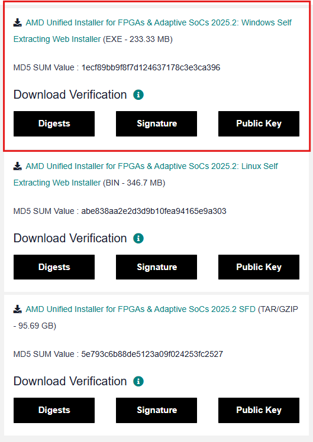
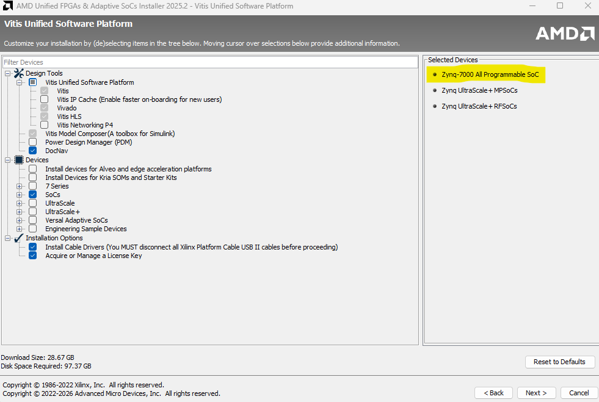
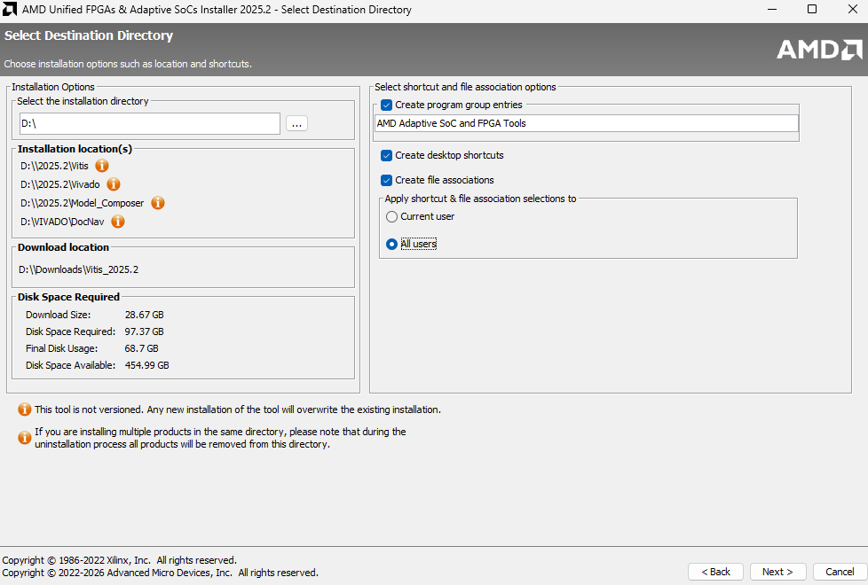
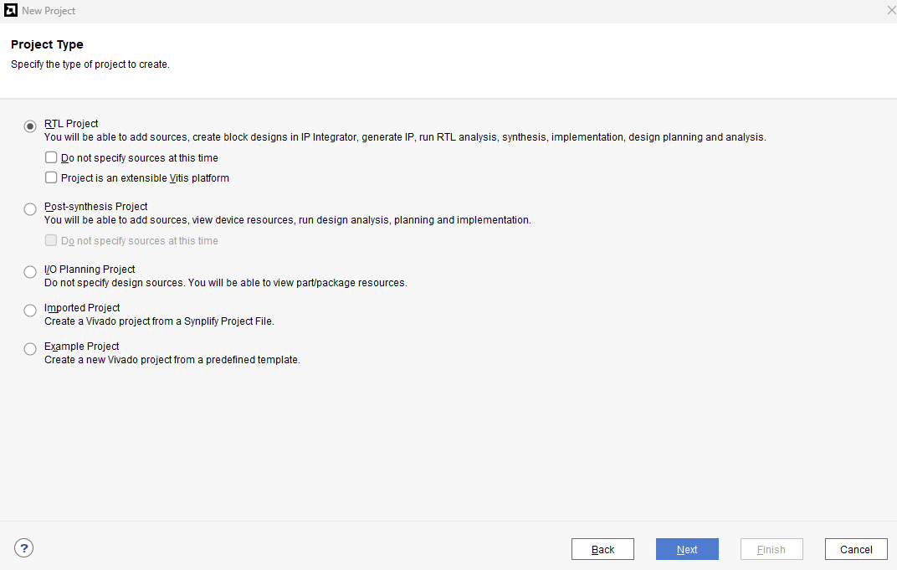
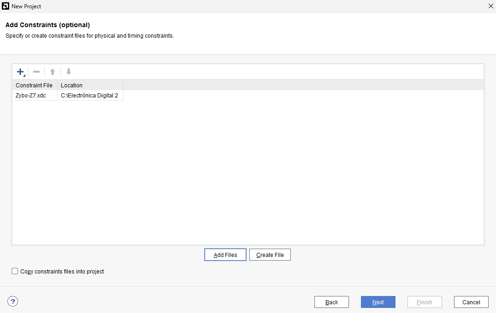
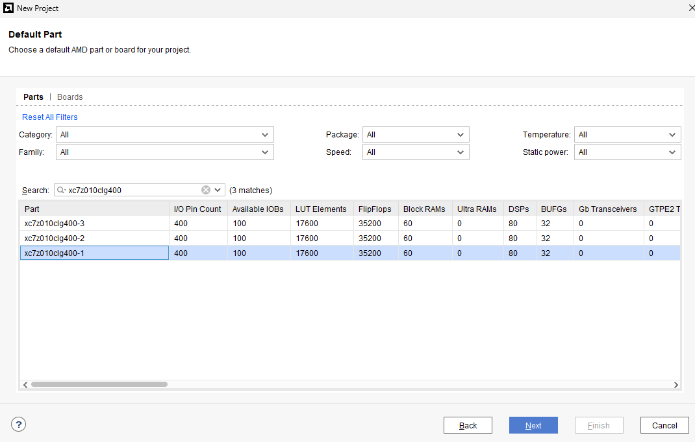

# Lab01: FPGA (Zybo Z7), Vivado/Vitis y Validación de Hardware

## Contenido
- Objetivos de aprendizaje  
- Fundamento teórico  
- Procedimiento  
- Descripción del HDL base  
- Entregables  

---

## 1. Objetivos de aprendizaje

- Instalar y verificar el correcto funcionamiento de **Vivado** y **Vitis**.
- Crear un proyecto para la tarjeta **Zybo Z7** y programar la FPGA mediante **JTAG**.
- Comprender el rol de los **constraints (.xdc)** para mapear señales HDL a pines físicos.
- Validar el funcionamiento de la tarjeta mediante un **Smoke Test**.
- Diseñar e implementar un **Test Funcional Personalizado** (lógica combinacional) usando:
  - **4 switches**
  - **6 botones**
  - **5 LEDs RGB**
- Integrar operaciones de **AND, OR, XOR** y una operación aritmética (**suma o resta de 4 bits**) en un diseño real sobre FPGA.

---

## 2. Fundamento teórico

### 2.1 FPGA vs simulación: del HDL a hardware real

En simulación (Lab00) se valida el comportamiento lógico en un entorno controlado.  
En una FPGA, ese mismo HDL se sintetiza y se implementa en hardware físico, por lo que entran en juego:

- El **reloj real** de la tarjeta.
- Entradas físicas (switches y botones) con rebote y tiempos no ideales.
- Salidas físicas (LEDs) que permiten observar resultados de forma directa.
- El mapeo físico de pines mediante **constraints**.

---

### 2.2 Constraints (.xdc) y mapeo de pines

El archivo `.xdc` define cómo se conectan las señales del módulo `top` con los pines reales de la tarjeta (IOs).  
Un diseño correcto en Verilog puede no funcionar en hardware si:

- Los pines están mal asignados.
- Se usó un estándar eléctrico incorrecto.
- Se conectó una señal a un pin inexistente o diferente.

**Idea clave:**  
El HDL define el hardware lógico, el `.xdc` define cómo ese hardware se conecta al mundo real.

---

### 2.3 Validación incremental: Smoke Test y Test Funcional

Antes de construir sistemas grandes (ALU, datapath, procesador), se valida el flujo completo:

1. Herramientas instaladas y funcionando.
2. Proyecto compila y genera bitstream.
3. La FPGA se programa sin errores.
4. Entradas/salidas funcionan como se espera.

Este laboratorio se enfoca en esa validación, y en la construcción de un test propio que obligue a usar
**lógica combinacional real** (compuertas + aritmética), para que cada que reciba en préstamo la tarjeta 
usted pueda verificar rápidamente su funcionamiento y como preparación inmediata para la ALU.

---

## 3. Procedimiento

### 3.0 Instalación de Vivado y Vitis

Este laboratorio utilizará:

- **Vivado**: diseño RTL, síntesis, implementación y generación de bitstream.
- **Vitis**: herramienta de desarrollo para flujo con procesadores (se instalará en este lab para dejar el entorno listo).

> Nota: Aunque Vitis se instala y verifica, el desarrollo de software sobre el PS (Zynq) se abordará más adelante.

#### 3.0.1 Instalación (Windows)
1. Cree una cuenta en la página de Xilinx en el siguiente (enlace)[https://www.amd.com/en/registration/create-account.html]
2. Descargue el instalador de Vivado y Vitis en el siguiente (enlace)[https://www.xilinx.com/support/download/index.html/content/xilinx/en/downloadNav/vivado-design-tools.html]
3. Seleccione la versión  AMD Unified Installer for FPGAs & Adaptive SoCs 2025.2: Windows Self Extracting Web Installer (EXE - 233.33 MB)

4. Una vez descargue, ejecute el instalador y seleccione **Vitis**

5. Elija la opción **Vivado ML Standard**
6. Elija específicamente las opciones marcadas en la siguiente imagen, asegúrese de no instalar más ya que la instalación le ocupará mucho más espacio:

7. Acepte todas las condiciones:

8. Seleccione el directorio donde quiere que se instale Vivado seleccionando las opciones de la imagen:

9. Presione instalar, no desconecte su computador de la red ni de la alimentación:

Si trabaja sobre Linux (acuda a este repositorio)[https://github.com/jharamirezma/Lab_electronica_digital_2/blob/main/labs/lab00/Vivado_vitis_installation_guide.md] propiedad y autoría del Docente Jhon Ramírez.

---

### 3.1 Configuración del proyecto para Zybo Z7

1. Una vez instalado, debe abrir Vivado.
2. Cree un nuevo proyecto en Vivado. Defina un nombre y su ubicación:

3. En la ventana Project Type elija **RTL Project** y seleccione **Next**:

4. En la ventana Add Sources debemos añadir los módulos de verilog, system verilog que tengamos creados para cada práctica/proyecto, por ejemplo:

5. En la ventana **Add Constraints** debemos incluir el archivo *.xdc* de configuración de pines. Desgargue el archivo [aquí](https://github.com/Digilent/Zybo-Z7-10-XADC/blob/master/src/constraints/Zybo-Z7.xdc)

6. En la ventana Default Part debemos elejir la referencia de la FPGA que se encuentra en la tarjeta de desarrollo ZyboZ7, que para el caso de las tarjetas que tenemos en el LABDIEE, la referencia es xc7z010clg400.

7. En la ventana *New Project Summary* encontrará un resumen de la creación del proyecto, presione **Finish** y eso es todo.

---

### 3.2 Verificación del entorno en FPGA (Smoke Test)

#### Descripción

El docente proveerá un **Smoke Test** para validar que la tarjeta está operativa y que el mapeo
de entradas/salidas es el correcto. Montaremos el semáforo que diseñamos en la práctica anterior

#### Actividad 1

1. Descargue el smoke test en el siguiente [link](src/semaforo.v) este será una versión básica del semáforo realizado en la práctica anterior
2. Lea y entienda cómo opera el código, además de identificar la(s) salidas y su implementación en el constrain, usaremos el LED RGB #6.
3. Corra la síntesis y la implementación el Vivado, luego, programe la Zybo Z7 con el bitstream generado tal como fue explicado en el tutorial visto en clase.
4. Verifique físicamente el comportamiento esperado.

> Si el Smoke Test no funciona correctamente, el estudiante debe resolver el problema de instalación, drivers,
cableado, o selección de tarjeta antes de continuar al Ejercicio 2.

---

### 3.3 Ejercicio 2: Test Funcional Personalizado (Diseño libre con criterios obligatorios)

En este ejercicio cada estudiante diseñará su propio sistema **combinacional** para validar rápidamente
que la FPGA, los pines y el `.xdc` funcionan correctamente.

---

#### Recursos disponibles (obligatorios)

- **Entradas:**
  - `SW[3:0]` (4 switches)
  - `BTN[5:0]` (6 botones)

- **Salidas:**
  - `LED[3:0]` (4 LEDs verdes ON/OFF)
  - `LED_RGB` (1 LED RGB: canales R, G, B)

> Total salidas visuales disponibles:  
> - 4 bits binarios directos  
> - 3 canales RGB adicionales  

---

#### Requisitos de diseño (obligatorios)

El diseño debe cumplir **TODOS** los siguientes requisitos:

1. **Usar las 10 entradas disponibles**
   - Los 4 switches deben afectar el comportamiento.
   - Los 6 botones deben afectar el comportamiento.
   - No se permite dejar entradas sin uso.

2. Utilizar todas las salidas:
   - Los 4 LEDs verdes deben mostrar información útil.
   - El LED RGB debe usarse de manera significativa (no decorativa).

3. Incluir explícitamente en el HDL:
   - Al menos una operación **AND**
   - Al menos una operación **OR**
   - Al menos una operación **XOR**
   - Una operación aritmética de 4 bits:
     - **Suma** o **resta**

4. El diseño **NO puede ser trivial**:
   - No se permite "un botón enciende un LED".
   - No se permite cableado directo tipo `assign LED = SW;` como diseño principal.
   - Debe existir procesamiento lógico real.

---

#### Restricción adicional (para evitar diseños demasiado simples)

El diseño debe incluir **dos operandos de 4 bits** construidos a partir de combinaciones de:

- Switches
- Botones

Por ejemplo:

- `A = SW[3:0]`
- `B = {BTN3, BTN2, BTN1, BTN0}`

O cualquier combinación equivalente que use ambas fuentes.

---

#### Recomendación de estructura (altamente sugerida)

Se recomienda que:

- `LED[3:0]` muestren el resultado aritmético (suma o resta).
- El LED RGB indique información adicional:
  - Rojo → operación AND
  - Verde → operación OR
  - Azul → operación XOR
  - O bien banderas como:
    - Zero
    - Carry
    - Paridad

Esto permite verificar en menos de 2 minutos que:

- Las compuertas funcionan.
- La suma/resta funciona.
- Todas las entradas afectan el resultado.
- El `.xdc` está correctamente asignado.

---

#### Ejemplo orientativo (no obligatorio)

**Mini test lógico-aritmético**

- `A = SW[3:0]`
- `B = {BTN3, BTN2, BTN1, BTN0}`
- BTN4 selecciona suma/resta.
- BTN5 invierte B antes de operar.

Operaciones implementadas:

- `AND_result = A & B`
- `OR_result  = A | B`
- `XOR_result = A ^ B`
- `SUM_result = A + B`

Salidas:

- `LED[3:0] = SUM_result`
- `LED_RGB.R = |AND_result` (reducción OR para indicar si hay algún 1)
- `LED_RGB.G = |OR_result`
- `LED_RGB.B = ^SUM_result` (paridad)

---

#### Evidencia requerida en el README

El estudiante debe incluir:

1. Descripción clara del diseño.
2. Explicación de:
   - Cómo se construyen los operandos.
   - Qué muestra cada LED.
3. Evidencia (foto o video) demostrando:
   - Funcionamiento correcto.
   - Uso de todas las entradas.
   - Uso de todas las salidas.
   - Presencia real de AND, OR, XOR y suma/resta en el código.

---

## 4. Descripción del HDL base

El repositorio del laboratorio debe incluir:

- Un módulo `top` (o wrapper) con las señales de entrada/salida definidas.
- Un archivo `.xdc` con el mapeo de pines provisto.
- Para el Ejercicio 1:
  - Un módulo combinacional principal (por ejemplo `test_funcional.v`)
  - Asignaciones claras para AND/OR/XOR y suma/resta.
  - Comentarios que indiquen qué se está mostrando en cada LED RGB.

> Nota: Aunque este ejercicio puede resolverse 100% combinacional, se recomienda mantener el diseño claro y modular
para facilitar el salto a ALU en el siguiente laboratorio.

---

## 5. Entregables

- Documentación del laboratorio en `README.md`, incluyendo:
  - Evidencia del Smoke Test (programación exitosa)
  - Evidencia y explicación del Ejercicio 1
- Carpeta `src/` con:
  - Código HDL del test funcional personalizado
  - (Opcional) módulos auxiliares reutilizables
- Demostración funcional durante la sesión de laboratorio

Todos los archivos deben ser cargados en el repositorio asignado en **GitHub Classroom**.
