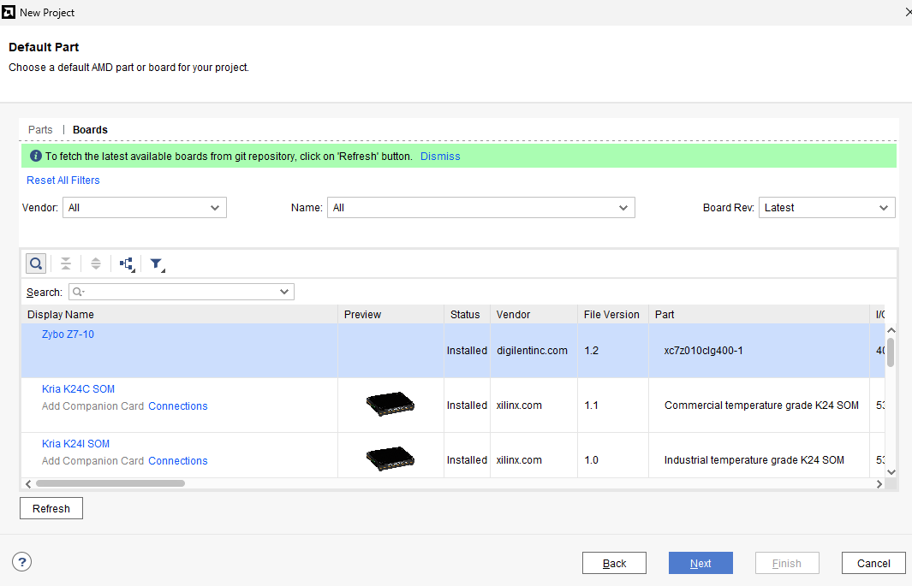
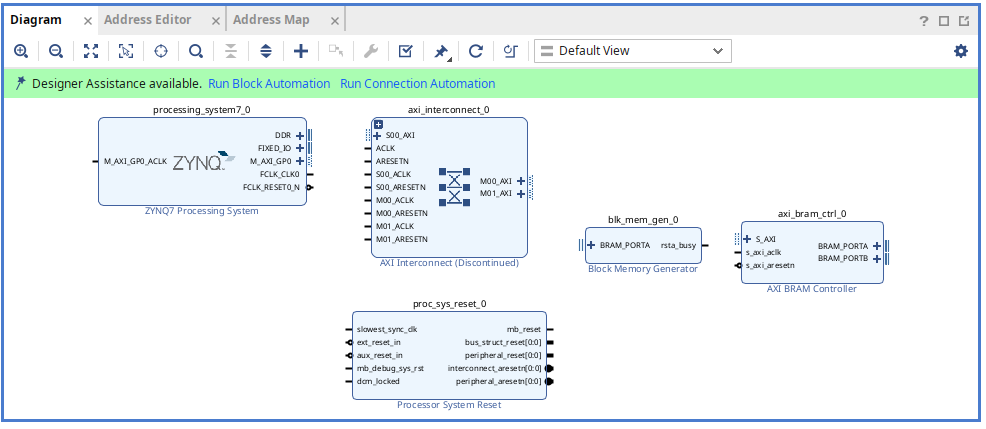
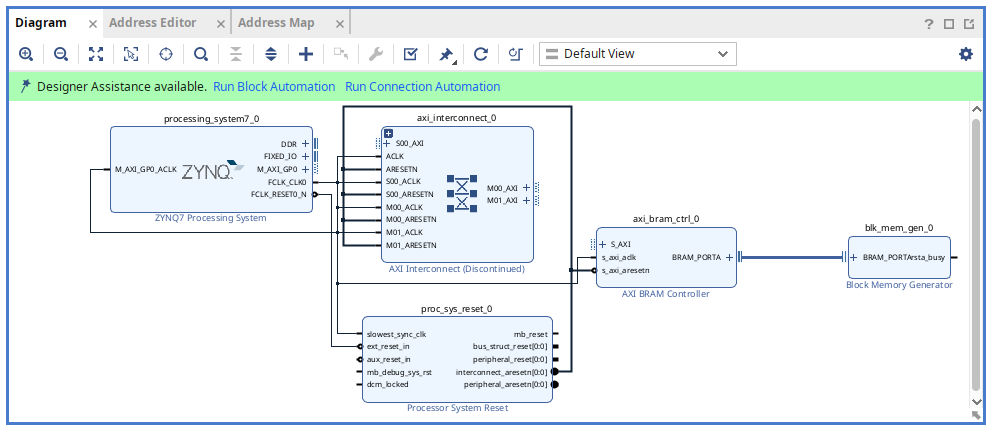
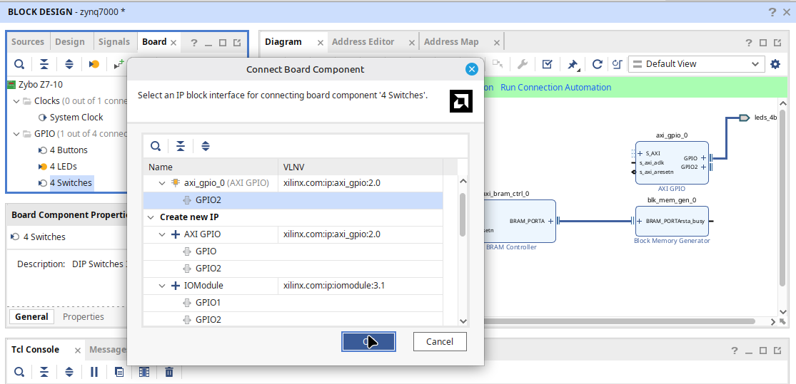
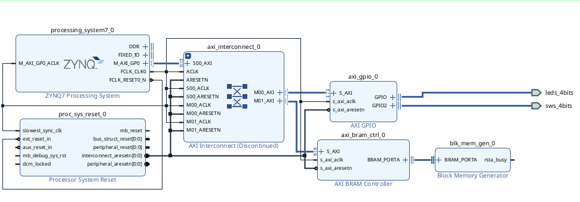
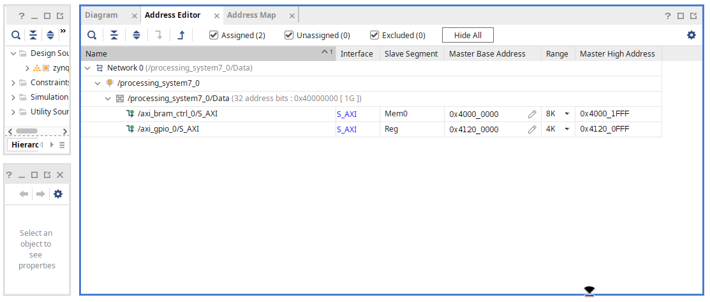
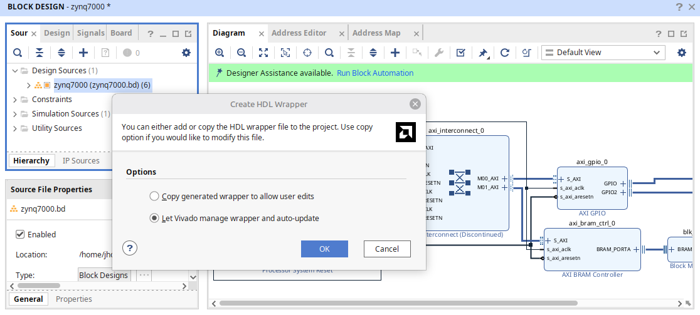
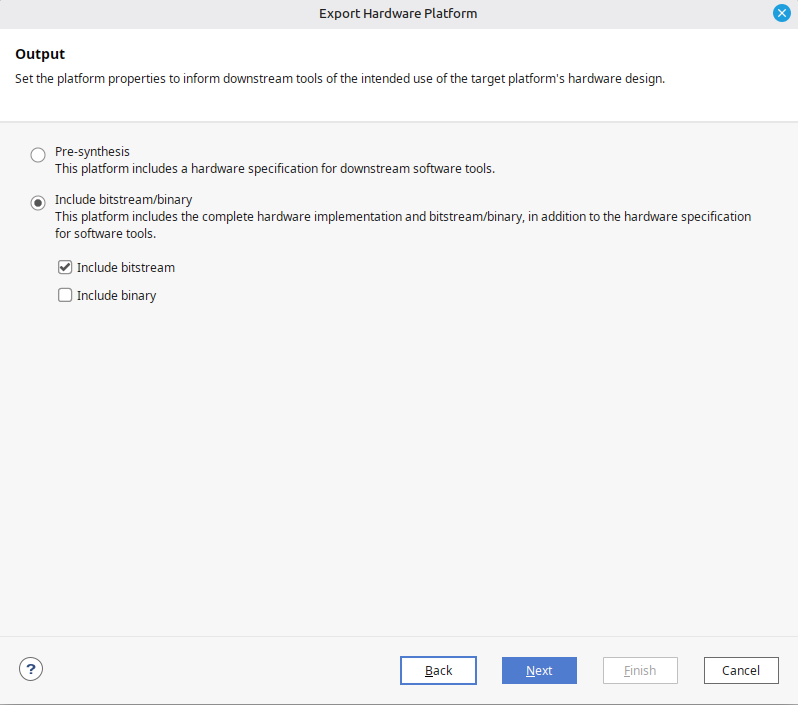

# Lab04 – SoC Zynq-7000

## Contenido

- Objetivos de aprendizaje  
- Fundamento teórico  
- Arquitectura del Zynq-7000  
- Procedimiento  
- Entregables  
- Referencias  

---

# 1. Objetivos de aprendizaje

Al finalizar esta práctica, el estudiante será capaz de:

- Implementar un **SoC** mediante la herramienta **Block Design** de Vivado.
- Identificar los bloques principales que componen el **Zynq-7000**.
- Comprender la integración entre procesador, memoria, periféricos y lógica programable.
- Reconocer la relación entre hardware programable y sistema embebido.
- Preparar una plataforma hardware para desarrollo posterior en **Vitis**.

---

# 2. Fundamento teórico

## 2.1 ¿Qué es un SoC?

Un **System on Chip (SoC)** es una arquitectura de hardware digital que integra en un único circuito los componentes esenciales de un sistema computacional. Generalmente incluye:

- Procesador central (**CPU**)
- Memoria ROM y RAM
- Periféricos de comunicación y control
- Temporizadores
- Interfaces de entrada y salida
- Buses internos de interconexión

El objetivo principal de un SoC es concentrar en un solo dispositivo las funciones necesarias para ejecutar aplicaciones completas, reduciendo tamaño, consumo y costo.

---

## 2.2 SoC implementado en FPGA

En esta práctica el sistema será implementado sobre una **FPGA Zybo Z7**, la cual incorpora el dispositivo **Zynq-7000**.

Esto permite trabajar con dos mundos en una sola plataforma:

- **Processing System (PS):** procesador ARM y periféricos integrados.
- **Programmable Logic (PL):** lógica reconfigurable tipo FPGA.

Gracias a esto, es posible diseñar sistemas donde una parte se ejecuta en software y otra en hardware.

---

# 3. Arquitectura del Zynq-7000

El **Zynq-7000** integra un procesador ARM Cortex-A9 junto con lógica programable Serie 7. Su arquitectura general se divide en dos grandes bloques:

## 3.1 Processing System (PS)

Corresponde al sistema de procesamiento embebido. Incluye:

- Procesador **ARM Cortex-A9**
- Memoria caché L1 y L2
- Controlador DDR
- Controladores SPI, I2C, UART, CAN, USB y Ethernet
- GPIO
- Temporizadores
- DMA
- JTAG y depuración

Este bloque permite ejecutar sistemas operativos o programas en lenguaje C.

---

## 3.2 Programmable Logic (PL)

Corresponde a la sección FPGA reconfigurable. Incluye:

- LUTs
- Flip-Flops
- Bloques DSP
- Memoria BRAM
- Ruteo programable
- Interfaces de alta velocidad

Aquí se implementan aceleradores hardware, periféricos personalizados o lógica digital diseñada por el usuario.

---

## 3.3 Comunicación entre PS y PL

Ambos bloques se comunican mediante buses **AXI**, lo que permite:

- Que el procesador controle hardware personalizado.
- Que módulos hardware accedan a memoria.
- Crear sistemas embebidos de alto desempeño.

---

## 3.4 Recursos utilizados en esta práctica

Durante este laboratorio se emplearán los siguientes componentes:

- **ZYNQ7 Processing System**
- Memoria interna BRAM
- Interfaz AXI
- GPIO para botones y LEDs
- Reset del sistema
- Aplicación software en Vitis

---

## Figura 1. Arquitectura general del Zynq-7000


---

# Observación técnica

En esta práctica se utilizará inicialmente el **Processing System** junto con periféricos básicos para comprender el flujo completo:

**Diseño hardware en Vivado → Exportación → Desarrollo software en Vitis**

# 4. Procedimiento
## 4.1 Integrar la Zybo-z7 al entorno de vivado.
1. Siga el paso a paso de la [siguiente página](https://digilent.com/reference/programmable-logic/guides/install-board-files?srsltid=AfmBOorC3OzN78uHx9FrXzecZKvcfOFIon4L6FowLLKsRxVVvsiouSiX) .
Puede instalar solo la Zybo Z7 - 10 copiando únicamente esa tarjeta.

## 4.2 Creación del SoC en Vivado
1. Cree un nuevo proyecto en vivado como lo ha hecho para anteriores entregas, con la diferencia de elegir la placa en vez de la FPGA. Para ello, diríjase en la ventana de "Default Part" en la pestaña "boards" y seleccione la tarjeta Zybo Z7-10 como se muestra en la siguiente imagen:


2. Después de crear el proyecto, en la interfaz de vivado, seleccione en el menú de la izquierda, en la categoría ```IP INTEGRATOR```, la opción ```Create Block Design```. Asignele un nombre al diseño y haga click en ```Ok```.
3. En la ventana ```Diagram``` seleccione el ícono ```+``` y añada uno a uno los siguientes bloques:
```Zynq Q7 Processing System
Processor System Reset
AXI Interconnect
AXI BRAM Controller
Block Memory Generator
```


4. Realice las conexiones como se muestra en la siguiente imagen:


5. Incluya los GPIOS de los leds y los switches seleccionándolos en la venta de la izquierda del diagrama. En la pestaña ```Board``` seleccione los GPIOs ```4 Buttons``` y ```4 LEDs```, haciendo doble click en cada uno de ellos y dando aceptar en el cuadro de diálogo que se muestra.


6. Realice las conexiones de ```clk``` y ```rst``` del nuevo bloque, luego haga click izquierdo en cualquier parte de la venta de ```Diagram``` y seleccione ```Regenerate Layout```. Su diagrama de bloques debe verse de la siguiente manera:


7. En la ventana del ```Diagram``` vaya a la pestaña ```Address Editor``` y en cualquier parte de la ventana en blanco haga click derecho y seleccione ```Assign```. Luego cambien el rango de memoria de 64K a 4 K de ```/axi_gpio_0/S_AXI```.


8. Regrese a la pestaña ```Diagram```, luego de la ventana de ```Source``` a la izquierda, seleccione la fuente de diseño, que para el caso de la imagen se llama ```Zynq 7000```, haga click derecho sobre este y seleccione ```Create HDL Wrapper```, en la ventana que aparece seleccione la opción ```Let Vivado manage wrapper and auto-update```, y de click en ```Ok```.

9. Después de que se haya generado el ```Wrapper``` regrese a la ventana de diagrama y en la parte superior de esta encontrará la opción ```Run Block Automatic```, de clic en ella y en la ventana de diálogo que aparece, de clic en ```Ok```.

10. Luego genere el ```Bitstream``` como ya lo ha hecho para laboratorios anteriores.
11. Luego de que se genere el ```Bitstream```, haga click en File - Export - Export Hardware. En la ventana que aparece (Export Hardware Platform), haga clic en ```next```, luego seleccione ```Include bitstream/binay``` y seleccione solamente ```Include Bistream```, luego haga clic en next, otra vez en next y finish. Con esta última acción se generó el archivo ```XSA``` que necesitará para el entorno de Vitis.



## 4.3 Entorno de Vitis

